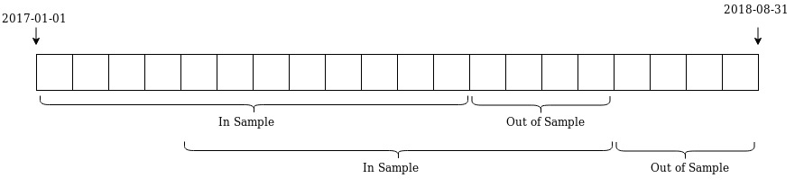

# fineng

Financial Engineering personal project from 2019 migrated from another repository.


### Instalação de dependências e preparação

Inicialmente, deverão ser adicionados os dados de input para serem testados. Todas ações deverão ser adicionadas ao caminho `dataset/stocks`. Além disso, o `.csv` do portfólio de refência deverá ser adicionado à pasta `dataset/benchmark`.


Depois  devem ser instaladas as dependências do projeto. Isso pode ser feito por meio do comando

```bash 
pip3 install -r requirements.txt
```

### Manipulação de dados


As ações a partir da função merge_csv_to_df() contida em fineng/datawrangling foram transformados em um único Dataframe.

Os retornos do índice S&P500 foram obtidos por meio da função get_sp500, que puxou esses dados do Yahoo! Finance e calculou o seu retorno.

Os retornos do portfólio de refência foram obtidos por meio da transformação do seu CSV contendo o seu retorno acumulado.

Por último, estes Dataframes devem ser transformados em uma classe chamada Benchmark a fim de padronizar com o resto do trabalho e salvas em um arquivo no formato Pickle

```python
from fineng.datawrangling import merge_csv_to_df, get_sp500, save_to_pickle,  return_from_pickle
import os 
from fineng.strategy import Benchmark
from fineng.datawrangling import save_to_pickle

prices = merge_csv_to_df()
returns = prices.pct_change()

benchmark_sp500 =  get_sp500()

b_sp500 = Benchmark(benchmark_sp500, name = 'S&P 500')


save_to_pickle(path = os.path.join('dataset','processed', "data_input.pickle"),
               variables = [returns,b_sp500]
              )

```

Posteriormente esses dados podem ser acessados por meio do seguinte comando:

```python
from fineng.datawrangling import return_from_pickle
import os 

returns ,b_sp500 = return_from_pickle(path = os.path.join('dataset','processed', "data_input.pickle"))


```

### Obtenção de portfólios

Para otimização do portfólio foi criada a classe Strategy. Essa classe possui os seguintes argumentos:

| Argumento | Propósito  |  Valor padrão |
|---|---|---| 
|  method | função objetivo a ser otimizada | |
| name | O nome que da estratégia (Para facilmente diferenciar em gráficos/análises  | |
| rets  | Dataframe de retornos dos ativos | |
| time_is  | Quntidade de meses a serem utilizados nos cálculos dos portfólios, período in-sample | 12 |
| time_os  | Quantidade de meses a serem simulados com base no que foi calculado no período in sample. É o período out-of-sample | 3 |
| min_w | Peso mínimo permitido por ação | 0 |
| max_w | Peso máximo permitido por ação | 0.05 |
| date_from | Data inicial de análise do portfólio | 2014-01-01 |
| date_to | Data inicial de análise do portfólio | 2017-12-31 |
| threads | Quantidade de threads a serem utilizadas nos cálculos. Seu valor depende da disponibilidade do computador em questão  | 1 |
| ewma  |  Exponentially Weighted Moving Average. Tenta dar mais importância para os dados mais recentes. Não foi utilizado nos testes | 1 |
| rsi | Relative Strength Index. Índice que tenta detectar ações supervalorizadas para eliminá-las do modelo. Não foi utilizado nos testes | False |

Para exemplificar, na imagem abaixo foi analisado o período entre 2017-01-1 e 2018-08-31. Uma vez que o período in-sample (time_is) foi definido como 12 meses, e o período out-of-sample (time_os) foi definido como 4 meses, foram feitas análises e simulações para 2 períodos.

   

Foram criados os seguintes métodos:

| Método | Explicação | Argumentos a serem adicionados |
|---|---|---|
| min_vol | Uma das formulações iniciais da Teoria Moderna de Portfólio. Dado um retorno desejado, calcula o portfólio com o menor desvio padrão possível.  |  Retorno Desejado |
| min_vol_master  | Calcula o portfólio com o menor desvio padrão possível. |   |
| max_sharpe | Com base no histórico das ações, tenta maximizar o Sharpe Ratio. O Sharpe Ratio é a razão entre retorno e volatilidade do portfólio. Isso significa que quanto maior o seu valor, maior é seu retorno por risco, então quanto maior melhor. |   |
| min_cvar | Com base no histórico das ações, tenta diminuir o valor médio das piores perdas do portfólio. Deve ser inserido no argumento 'args' o percentual dessas piores perdas (Geralmente é utilizado 5%)  | Valor do CVar |
| max_return_1 | Busca maximizar o retorno tendo diferentes percentis superiores ao de seu benchmark | Retorno do Benchmark  |
| sthocastic_dominance_1 | Busca maximizar a distância do menor percentil do índice em relação ao de seu benchmark;  | Retorno do Benchmark  |
| equally_weighted | Portfólio igualmente distribuído |   |
| random | Portfólio com pesos definidos aleatoriamente |   |

No exemplo abaixo, foram criados 5 portfólios:

* Um igualmente distribuído
* Um maximizando o Sharpe com máximo de 5% por ação
* Um maximizando o Sharpe com máximo de 10% por ação
* Um maximizando o retorno com máximo de 5% por ação
* Um minimizando a volatilidade com um máximo de 5% por ação

```python

from fineng.strategy import Strategy, Benchmark
from fineng.datawrangling import save_to_pickle

equally_weighted = Strategy(method = 'equally_weighted',
                        name = 'Equally Weighted',
                        rets = returns,
                        time_is = 12, 
                        time_os = 3, 
                        date_from = '2013-01-01', 
                        date_to = '2017-12-31',
                        threads= 4)

max_sharpe_10 = Strategy(method = 'max_sharpe',
                        name = 'Max Sharpe 0.1',
                        rets = returns,
                        time_is = 12, 
                        time_os = 3, 
                        max_w= 0.1,
                        date_from = '2013-01-01', 
                        date_to = '2017-12-31',
                        threads= 4)

max_sharpe_05 = Strategy(method = 'max_sharpe',
                        name = 'Max Sharpe 0.05',
                        rets = returns,
                        time_is = 12, 
                        time_os = 3, 
                        max_w= 0.05,
                        date_from = '2013-01-01', 
                        date_to = '2017-12-31',
                        threads= 4)


max_return1 = Strategy(method = 'max_return1',
                        name = 'Max Return 1',
                        rets = returns,
                        args = b_sp500.strategy_ret,
                        time_is = 12, 
                        time_os = 3, 
                        max_w= 0.05,
                        date_from = '2014-01-01', 
                        date_to = '2017-12-31',
                        threads= 4)

min_vol_p = Strategy(method = 'min_vol_master',
                        name = 'Min Vol',
                        rets = returns,
                        time_is = 12, 
                        time_os = 4, 
                        date_from = '2013-01-01', 
                        date_to = '2017-12-31',
                        threads= 4)


save_to_pickle(path = os.path.join('dataset', "portfolios.pickle"),
               variables = [equally_weighted, max_sharpe_10, max_sharpe_05, max_return1, min_vol_p]
              )

```

Os portfólios podem ser acessados por meio da seguinte função:

```python

analysis.compare_strategies([equally_weighted, max_sharpe_10, max_sharpe_05, max_return1, min_vol_p], benchmark=b_sp500)

```

As estratégias podem ser analisadas de forma comparativa utilizando a seguinte função:

```python

analysis.compare_strategies([equally_weighted, max_sharpe_10, max_sharpe_05, max_return1, min_vol_p], benchmark=b_sp500)

```

Além disso, podem ser individualmente analisadas de forma mais detalhadas:

```python
analysis.analyse_strategy(max_sharpe10, benchmark=b_sp500, show_weight=True)
```

### Módulos do repositório

| Nome | Conteúdo | 
|---|---|
| strategy | Módulo com a classe estratégia, responsável pelo cálculo de uma estratégia por um período;  |
| analysis | Módulo com funções de análise de estratégia |
| data_wrangling | Módulo com funções para manipulação de dados |
| port_optimization | Módlo com funções que calculam os pesos dos portfólios |
| objective_function | Módulo com funções a serem utilizadas pelo otimizador |
| calculation | Módulo com funções de cálculos financeiros | | 
| utils | Módulo com demais funções |

### Trabalhos futuros
* Aplicar testes para retornos de 2018/2019;
* Aplicar testes para outros mercados;
* Aplicar testes utilizando um limite de peso por ação menor (Foi utilizado 10%, um valor alto);
* Aplicar testes utilizando shorting;
* Aplicar testes utilizando EWMA (Exponentially Weighted Moving Average) a fim de dar mais importância para dados históricos mais recentes;
* Aplicar teste utilizando RSI (Relative Strength Index) a fim de detectar ações supervalorizadas para eliminá-las do modelo;
* Aplicar teste para diferentes periodicidades de in sample e out-of-sample(Mensal e trimestral);
* Aplicar métodos de otimização não convexa para resolver a otimização por outros índices (Sortino, Treynor, Starr);
* Aplicar modelos que consideram minimização de custo de corretagem;
* Aplicar Bootstrapping para simular valores futuros;