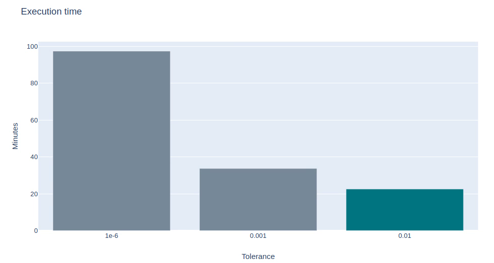
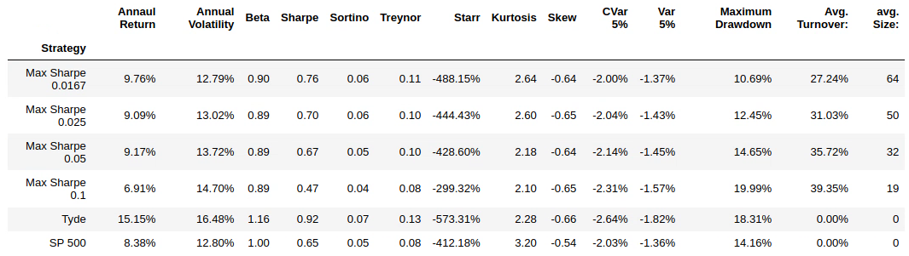

# Resultados parciais e conclusões - Dezembro/2019

Este arquivo tem como objetivo documentar os principais resultados e conclusões a respeito da otimização do índice Sharpe até dezembro de 2019.

## Tolerância máxima da otimização

Foram feitos testes para avaliar a diferença de perfomance tanto em relação ao tempo quanto ao retorno da estratégia utilizando diferentes tolerâncias na otimização. Foram feitos testes usando para a otimização do índice Sharpe 3 tolerâncias: 0.01, 0.001 e 1e-6. Os rendimentos das estratégias são aprestandos no gráfico abaixo.

  

Como é possível perceber, os resultados não foram diferentes um do outro (As linhas do 1e-6 e 0.01 estão abaixos da linha do 0.001). Porém, ao comparar os tempos de execução, ocorreu uma grande diferença. Os tempos com tolerância de 0.01 foram muito inferiores. Dessa forma, foi concluído que deve ser utilizada esta configuração para futuras otimizações.

  

## Fonte de dados
 
Os dados fornecidos pela Brasil Plural não são perfeitos para a análise. Não apenas por existerem alguns erros em relação a alguns splits calculados de forma incorreta, mas também faltarem muitas ações. Só estão disponibilizadas as ações de tickers atualmente listados no S&P 500. Isso significa que se uma empresa sair em determinado dia do S&P 500, no dia seguinte já não será mais possível obter suas informações históricas. Além disso, se uma empresa mudar de ticker, não será mais possível obter informações de quando o ticker dela era outro.

Foram feitas tentativas para obter dados de outras fontes:

* NASDAQ: É possível extrair os dados do site da NASDAQ de forma automática. Isso foi feito, porém percebemos que o site apresenta o mesmo problema de apenas disponibilizar tickers de empresas atualmente listadas no S&P 500. Além disso os fechamentos não possuem ajuste para dividendos, apenas para split.

* AlphaVantage: AlphaVantage é um site que disponibiliza dados ajustados por split e dividendo de forma totalmente gratuita (Desde que seja respeitado o limite de 500 requisições por dia sendo no máximo 5 a cada minuto). Eles possuem dados de todas ações, mesmo as que nunca estiveram no S&P 500. Infelizmente, foram constatados alguns erros em certos splits. Dessa forma, seus dados não foram considerados apropriados para backtest. O site possui uma boa proposta de fornecer dados confiáveis e a um preço acessível (De graça, ou de 20 a 70 dólares por mês para ter mais requisições)

* Bloomberg: A tentativa final foi a Bloomberg. Com ela, foi possível acessar ações de quase todas empresas. Porém, algo estranho ocorreu. Mesmo o sistema estando com a opção de retornar preços com ajuste de dividendo e splits, apenas os splits foram feitos de forma correta. É um problema que ainda deve ser investigado. Além disso, algumas ações não tiveram seus preços retornados, o que também deve ser analisado.

Então ficou decidido o seguinte: Para as análises serão utilizados os dados da Brasil Plural para empresas atualmente listadas no S&P 500. Para as outras empresas, serão utilizados os dados da Bloomberg (Que não possuem ajuste por dividendo)

Além disso, é importante enfatizar que faltaram algumas ações na otimização, como apresentado no gráfico abaixo. Ao buscar os dados da Bloomberg, foi utilizada uma lista de tickers salvo anteriormente em outro trabalho, e foi acrescentada a composição do S&P 500 desde 2013 pelo Wikipedia. Porém faltaram ações em alguns períodos. A razão da ausência dessas empresas ainda não foi investigada. É necessária outra ida para a Butiá para tentar buscar o que está faltando. 

  

## Viés de sobrevivência

Foram feitas adaptações no código original do projeto para que o problema do viés de sobrevivência fosse resolvido. O passo a passo foi salvo no arquivo vies_de_sobrevivencia.ipynb. Foi feito um tratamento nos dados para que em cada período seja considerado apenas a composição corrente do S&P 500. Por exemplo, em agosto de 2018 deve ser calculada a composição de acordo com a divulgação mais recente do índice (No caso, divulgada em abril de 2018)   

## Resultados dos testes

Com as adaptações feitas, foram feitas simulações considerando 4 pesos máximos por ação: 1.67%, 2.5%, 5% e 10%. Os rendimentos foram apresentados no gráfico.

  

É possível perceber que o rendimento do portfólio da Tyde foi muito superior ao rendimento das estratégias. Porém os rendimentos dos portfólios tiveram um rendimento superior se comparados ao rendimento do S&P 500. 

  

Ao analisar as estatísticas foi constatado que o portfólio da Tyde continua sendo o com o maior retorno, e possui também o melhor Sharpe. Os portfólios com a maximizaçao do Sharpe foram mais conservadores, tendo Beta inferior a 1 e sendo menos volateis em relação à volatilidade, CVar e Maximum Drawdown. 

É importante enfatizar que os rendimentos estão um pouco subestimados devido a ausência de ajuste por dividendo para algumas empresas.

## Próximos passos

Nesta sessão são listados os próximos passos a serem desempenhados para melhorias neste projeto. Coloquei na ordem do que considero mais factível e importante.

* Obtenção dos dados faltantes na Butiá;

* Entendimento da causa dos dados da Bloomberg terem vindo sem dividendos;

* Melhoria e validação do processo de filtragem de ações presentes no S&P 500 para cada período de composição do índice(O código ficou um pouco confuso e ineficiente por ter sido feito com pressa);

* Geração de simulações para outros modelos como a otimização do CVar. Este e outros modelos foram simulados para a base completa, mas ainda não foi feito para a base que tenta eliminar o bias de sobrevivência.

* Geração de simulações para modelos que ainda não foram otimizados (Alguns deles não devem ser possíveis de serem facilmente otimiados por não terem função convexa) Imagino que a otimização do Starr Ratio(Retorno sobre CVar) seja convexa e possa trazer resultados satisfatórios.

* Aplicar testes em outros datasets e testes utilizando técnicas do simulador de cenários.

* Integrar o arquivo ao projeto principal (Possivelmente necessitará grandes mudanças para utilizar as classes de simulação do projeto principal da Tyde)

* Deixar de considerar apenas resultados históricos para análise. Deve-se utilizar algo mais robusto como a previsão de retorno de cada ação. E testar simulações que tentam priorizar dados mais recentes (Por meio do EWMA (Exponentially Weighted Moving Average))

* Tentar descartar ações com alguma técnica. Pode ser algo que envolva ML ou uma critério frio mesmo, com o uso de RSI (Relative Strength Index)

* Aplicação de modelos mais avançados como Dominância Estocástica (Possui alto custo por não serem modelos triviais)
